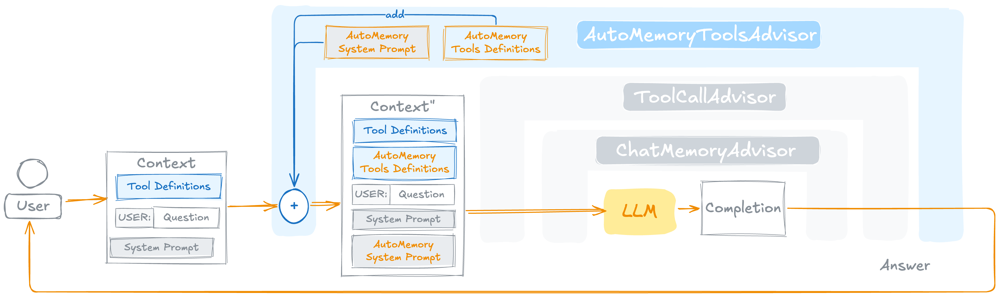

# AutoAutoMemoryToolsAdvisor

A Spring AI `ChatClient` advisor that gives any agent **automatic long-term memory** by wiring [`AutoMemoryTools`](AutoMemoryTools.md) and its companion system prompt into the request pipeline as a single, self-contained unit.



## What it does

On every `before()` call the advisor:

1. **Augments the system message** — appends `AUTO_MEMORY_TOOLS_SYSTEM_PROMPT.md` (with the configured memories root path rendered in) to whatever system message is already present.
2. **Injects the six `AutoMemoryTools`** — registers `MemoryView`, `MemoryCreate`, `MemoryStrReplace`, `MemoryInsert`, `MemoryDelete`, and `MemoryRename` into the prompt's `ToolCallingChatOptions`. Existing callbacks with the same name are never duplicated.
3. **Optionally appends a consolidation reminder** — if the configurable `memoryConsolidationTrigger` predicate returns `true`, a `<system-reminder>` block is appended to the system message instructing the model to summarise and remove redundant memories.

If the prompt carries no `ToolCallingChatOptions` the request is returned unchanged — both the tool injection and the system prompt augmentation are skipped.

`after()` is a passthrough. Memory persistence is driven entirely by the model via tool calls during the conversation; no post-processing is needed.

## Long-term memory vs. session memory

`AutoAutoMemoryToolsAdvisor` is a **long-term memory** mechanism. It is designed to complement, not replace, Spring AI's built-in short-term conversation memory (e.g. `MessageChatMemoryAdvisor` + `MessageWindowChatMemory`). The two layers serve fundamentally different purposes and should normally be used together:

| | Session memory (`MessageChatMemoryAdvisor`) | Long-term memory (`AutoAutoMemoryToolsAdvisor`) |
|---|---|---|
| **Scope** | Current conversation only | Persists across conversations |
| **Storage** | In-process (`ChatMemory`) | Files on disk via `AutoMemoryTools` |
| **Content** | Full message exchange — every turn | Curated facts worth keeping forever |
| **Managed by** | Spring AI automatically | The model itself via tool calls |
| **Expires** | When the process stops (or window fills) | Never — until the model deletes a file |

A typical agent setup combines both:

```java
ChatClient chatClient = ChatClient.builder(chatModel)
    .defaultAdvisors(
        // Long-term memory — facts that survive across sessions
        AutoAutoMemoryToolsAdvisor.builder()
            .memoriesRootDirectory("/home/user/.agent/memories")
            .build(),

        // Short-term memory — full conversation history for this session
        MessageChatMemoryAdvisor.builder(
            MessageWindowChatMemory.builder().maxMessages(100).build())
            .build(),

        // Tool calling
        ToolCallAdvisor.builder().build())
    .build();
```

In this setup the model has the best of both worlds: the full context of the current conversation via the session window, and persistent knowledge about the user and project that it accumulated over previous sessions via the memory files.

**Rule of thumb:**
- Ephemeral details — what was said in this session, in-progress task state — belong in session memory.
- Durable facts worth having next week — user preferences, project decisions, behavioural feedback — belong in long-term memory.

## Quick Start

```java
AutoAutoMemoryToolsAdvisor memoryAdvisor = AutoAutoMemoryToolsAdvisor.builder()
    .memoriesRootDirectory("/home/user/.agent/memories")
    .build();

ChatClient chatClient = ChatClient.builder(chatModel)
    .defaultAdvisors(memoryAdvisor)
    .build();
```

That's all. On the first turn the model reads `MEMORY.md` via `MemoryView`, loads relevant memory files, and writes new memories at the end of the session — all without any extra wiring.

## Builder Configuration

```java
AutoAutoMemoryToolsAdvisor advisor = AutoAutoMemoryToolsAdvisor.builder()
    .memoriesRootDirectory("/path/to/memories")          // required
    .order(BaseAdvisor.HIGHEST_PRECEDENCE + 200)         // optional
    .memorySystemPrompt(customPromptResource)            // optional
    .memoryConsolidationTrigger((req, instant) -> false) // optional
    .build();
```

| Builder method | Type | Default | Description |
|---|---|---|---|
| `memoriesRootDirectory(String)` | `String` | — (**required**) | Root directory for all memory files. Created automatically if absent. |
| `order(int)` | `int` | `HIGHEST_PRECEDENCE + 200` | Advisor order. Runs before the default `ToolCallingAdvisor` at `+300`. |
| `memorySystemPrompt(Resource)` | `Resource` | `classpath:/prompt/AUTO_MEMORY_TOOLS_SYSTEM_PROMPT.md` | Prompt template to inject. Must contain the `{MEMORIES_ROOT_DIERCTORY}` placeholder. |
| `memoryConsolidationTrigger(BiPredicate<ChatClientRequest, Instant>)` | `BiPredicate` | `(req, t) -> false` | Evaluated on each request. When `true`, a consolidation reminder is appended to the system message. |

### Validation

- `memoriesRootDirectory` must be a non-empty string — `build()` throws `IllegalArgumentException` if blank.
- `memorySystemPrompt` must not be null — the builder method throws immediately if null is passed.
- `memoryConsolidationTrigger` must not be null — the builder method throws immediately if null is passed.

## Memory Consolidation Trigger

Over time the memory store can accumulate redundant or outdated entries. The `memoryConsolidationTrigger` lets you inject a reminder at a chosen frequency to prompt the model to clean up:

```java
// Trigger consolidation roughly every 20 requests (stateless approximation)
AutoAutoMemoryToolsAdvisor advisor = AutoAutoMemoryToolsAdvisor.builder()
    .memoriesRootDirectory("/path/to/memories")
    .memoryConsolidationTrigger((req, instant) ->
        Math.random() < 0.05)   // ~5 % of requests
    .build();
```

When the predicate returns `true`, the following block is appended to the system message:

```
<system-reminder>Consolidate the long-term memory by summarizing and removing redundant information.</system-reminder>
```

The predicate receives:

| Parameter | Type | Description |
|---|---|---|
| `request` | `ChatClientRequest` | The full in-flight request — inspect messages, context, or metadata to decide. |
| `instant` | `Instant` | Wall-clock time of the current call — useful for time-based intervals. |

Common trigger strategies:

```java
// Time-based: every 24 hours
Instant[] lastConsolidation = { Instant.now() };
.memoryConsolidationTrigger((req, now) -> {
    if (Duration.between(lastConsolidation[0], now).toHours() >= 24) {
        lastConsolidation[0] = now;
        return true;
    }
    return false;
})

// Turn-count-based: every N calls
AtomicInteger counter = new AtomicInteger();
.memoryConsolidationTrigger((req, now) ->
    counter.incrementAndGet() % 50 == 0)
```

## Advisor Ordering

The default order `BaseAdvisor.HIGHEST_PRECEDENCE + 200` places this advisor **before** the `ToolCallingAdvisor` (which sits at `+300`). This ordering ensures memory tools are registered in the options before the tool-calling advisor processes them.

If you use other advisors that also modify tool options (e.g. additional `ToolCallingAdvisor` instances), verify that their relative order does not prevent the memory tools from reaching the model.

## Relation to AutoMemoryTools

`AutoMemoryToolsAdvisor` is a thin orchestration layer. The six memory operations, sandboxing logic, and file conventions all live in [`AutoMemoryTools`](AutoMemoryTools.md). The advisor adds:

- Automatic system prompt injection (no need to configure the prompt separately on the `ChatClient`)
- Automatic tool registration (no need to call `.defaultTools(memoryTools)`)
- Duplicate-filtering guard so memory tools are never registered twice
- The optional consolidation trigger

### Manual setup vs. advisor

If you need full control over when and how the system prompt and tools are applied, you can wire `AutoMemoryTools` directly without the advisor:

```java
// Manual setup
AutoMemoryTools memoryTools = AutoMemoryTools.builder()
    .memoriesDir("/path/to/memories")
    .build();

String memoryPrompt = new PromptTemplate(memorySystemPromptResource)
    .render(Map.of("MEMORIES_ROOT_DIERCTORY", memoriesDir));

ChatClient chatClient = ChatClient.builder(chatModel)
    .defaultSystem(baseSystemPrompt + "\n\n" + memoryPrompt)
    .defaultTools(memoryTools)
    .defaultAdvisors(ToolCallAdvisor.builder().build())
    .build();

// Advisor setup — equivalent, less boilerplate
ChatClient chatClient = ChatClient.builder(chatModel)
    .defaultAdvisors(
        AutoAutoMemoryToolsAdvisor.builder()
            .memoriesRootDirectory("/path/to/memories")
            .build(),
        ToolCallAdvisor.builder().build())
    .build();
```

## System Prompt

The default companion prompt (`AUTO_MEMORY_TOOLS_SYSTEM_PROMPT.md`) is bundled in the jar at `classpath:/prompt/AUTO_MEMORY_TOOLS_SYSTEM_PROMPT.md`. It instructs the model to:

- Read `MEMORY.md` at the start of sessions where prior context may be relevant
- Use the two-step save workflow (`MemoryCreate` → `MemoryInsert` into `MEMORY.md`)
- Apply the four memory types (`user`, `feedback`, `project`, `reference`)
- Verify recalled memories before acting on them
- Avoid saving ephemeral state, code patterns, git history, or fix recipes

The template contains one placeholder: `{MEMORIES_ROOT_DIERCTORY}` (note the spelling), which is filled with the configured `memoriesRootDirectory` at `build()` time.

To use a custom prompt, provide any `Resource` that contains the same placeholder:

```java
@Value("classpath:/my-custom-memory-prompt.md")
Resource customPrompt;

AutoAutoMemoryToolsAdvisor.builder()
    .memoriesRootDirectory("/path/to/memories")
    .memorySystemPrompt(customPrompt)
    .build();
```

## Demo Application

See [`memory-tools-advisor-demo`](https://github.com/spring-ai-community/spring-ai-agent-utils/tree/main/examples/memory/memory-tools-advisor-demo) for a complete runnable example showing `AutoAutoMemoryToolsAdvisor` combined with `ToolCallAdvisor`, `MessageChatMemoryAdvisor`, and a custom logging advisor.

## See Also

- [AutoMemoryTools](AutoMemoryTools.md) — the underlying tool implementations, file conventions, and security model
- [FileSystemTools](FileSystemTools.md) — general-purpose file read/write/edit (not sandboxed)
- [Claude Code — Memory](https://code.claude.com/docs/en/memory) — the file-based memory design this library is modelled after
- [Claude API SDK — Memory Tool](https://platform.claude.com/docs/en/agents-and-tools/tool-use/memory-tool) — the official tool specification
